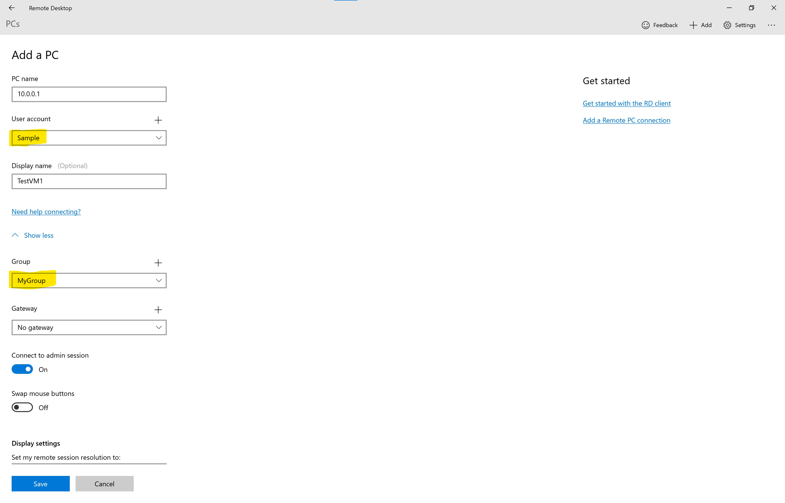
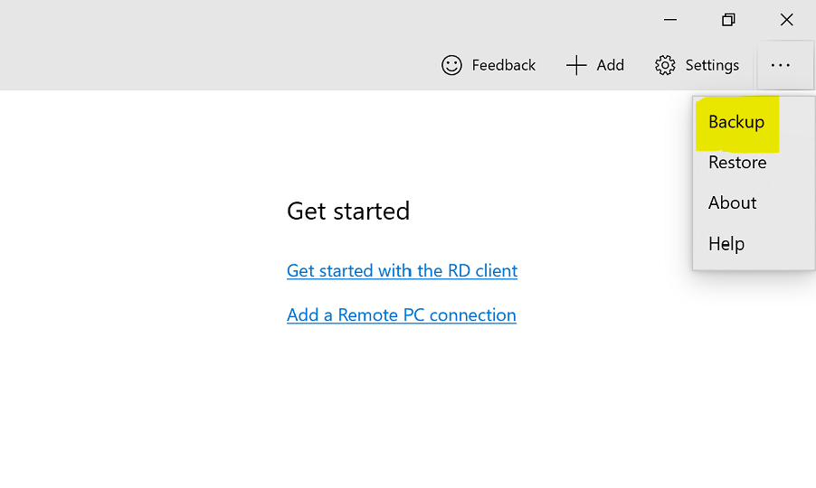
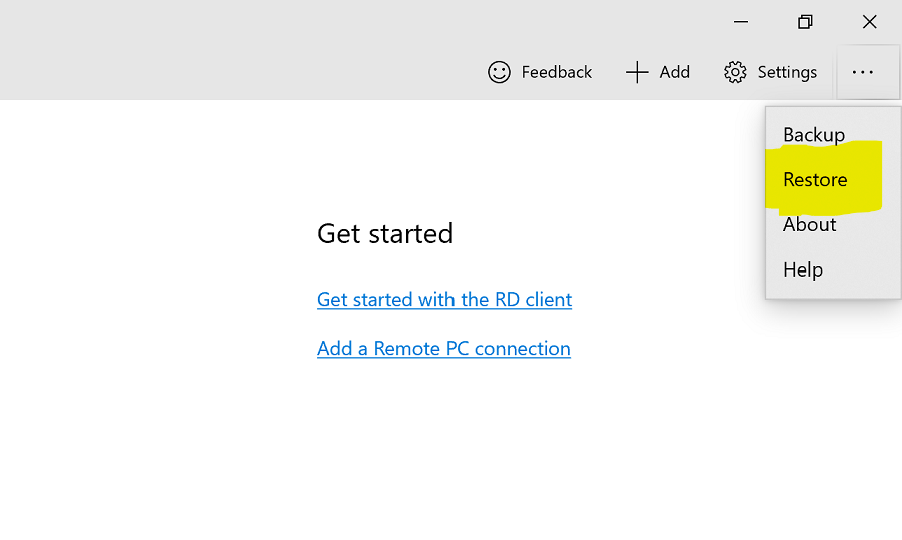

## Extend-RDC-Backup
A solution to add VMs in bulk to Microsoft Remote Desktop Windows Store App.

### Problem Statement
Microsoft Remote Desktop (From Windows Store App) currently do not support bulk addition of VMs. However there is a way to restore VMs from Backup.

### Solution Approach
This PowerShell script will read the current backup and extend the backup with additional required VM entries from CSV input file.

### Steps:
1. Create a new Connection manually for one of the VM
    
2. Make a note of `User account`, `Group`, we will use it in the parameter of the PowerShell Script.
3. Take a backup of the existing Remote Desktop Connections
    
4. Place the backup `*.rdb` backup file at the same place where `Extend_RDC_Backup.ps1` exists.
5. List out all your VMs in the `Extend_RDC_Backup.Input.csv` file. Don't worry, script will skip duplicates if any VM already exists in backup 🙂.
6. Update the Parameters of PowerShell Script
    |Parameter  |Description  |
    |---------|---------|
    |$VMDetailsInputFile | CSV Input file where all your VMs are listed |
    |$InputRDCBackupFile | `*rdb` backup file which you have obtained from `Step #3` |
    |$RDCGroupName | `Group` name from `Step #2` |
    |$RDCUserAccountName | `User account` from `Step #2` |
    |$OutputRDCBackupFile | Your output backup file which should be in `*.rdb` format |
7. User your output backup file and Restore the new backup on Remote Desktop Connections App
    

### License
All files within this repo are released under the [MIT (OSI) License]( https://en.wikipedia.org/wiki/MIT_License) as per the [LICENSE file](https://github.com/BipulRaman/Extend-RDC-Backup/blob/master/LICENSE) stored in the root of this repo.
